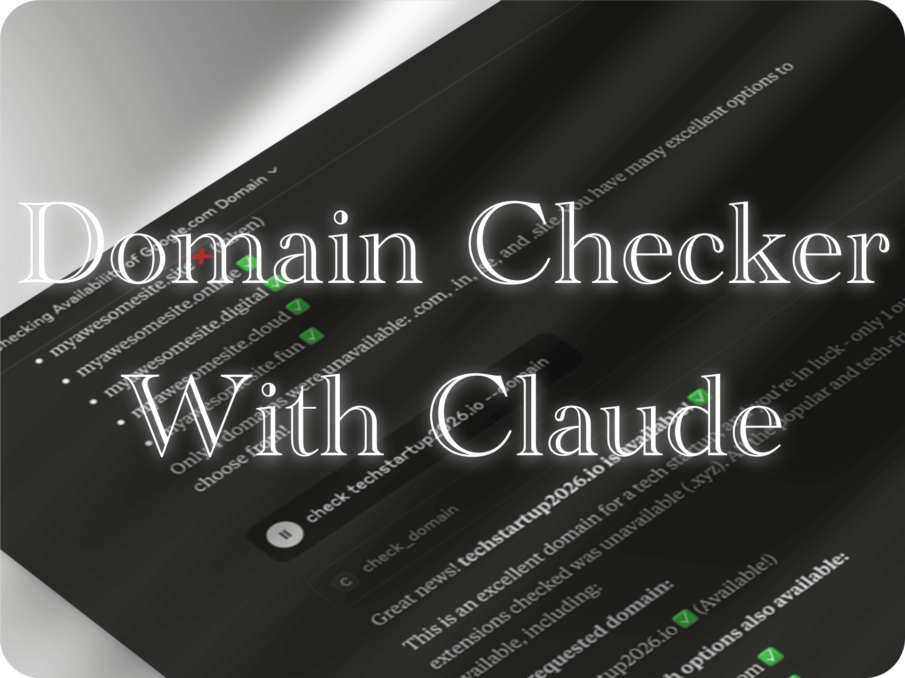

## MCP Domain Availability Checker

[](https://smithery.ai/server/@imprvhub/mcp-domain-availability)

<table style="border-collapse: collapse; width: 100%; table-layout: fixed;">
<tr>
<td style="width: 40%; padding: 15px; vertical-align: middle; border: none;">A Model Context Protocol (MCP) integration that provides Claude Desktop with domain availability checking across popular TLDs.</td>
<td style="width: 60%; padding: 0; vertical-align: middle; border: none; min-width: 300px; text-align: center;"><a href="https://glama.ai/mcp/servers/@imprvhub/mcp-domain-availability">
  
</a></td>
</tr>
</table>

### Features

- **Domain Availability Checking**
  - Check availability across 50+ popular TLD extensions
  - Support for popular (.com, .io, .ai), country (.us, .uk, .de), and new TLDs (.app, .dev, .tech)
  - Dual verification using DNS and WHOIS for accuracy
  - Smart TLD suggestions organized by popularity

- **Search Capabilities**
  - Check specific domains with exact TLD matching
  - Bulk checking across supported extensions for a given name
  - Parallel processing for faster domain queries
  - Organized results by TLD categories

- **MCP Integration**
  - Easy setup with uvx package management
  - Seamless integration with Claude Desktop
  - Real-time availability status updates
  - Performance metrics and timing information

- **AI Assistant Features**
  - Natural language domain queries through Claude
  - Automated domain suggestion workflows
  - Smart recommendations based on availability

### Demo
<p>
 <a href="https://www.youtube.com/watch?v=pJjrkEihlWE">
   
 </a>
</p>

<details>
<summary>Timestamps:</summary>
Click on any timestamp to jump to that section of the video

[**00:00**](https://www.youtube.com/watch?v=pJjrkEihlWE&t=0s) - **Checking google.com availability**  
Testing a well-known premium domain to demonstrate the domain checking functionality and alternative TLD suggestions.

[**00:20**](https://www.youtube.com/watch?v=pJjrkEihlWE&t=20s) - **Testing myawesomesite.com**  
Verifying availability for a custom domain name and exploring alternative extension options.

[**00:40**](https://www.youtube.com/watch?v=pJjrkEihlWE&t=40s) - **Verifying techstartup2026.io**  
Exploring tech startup domain options and checking availability across multiple TLD extensions.

[**01:00**](https://www.youtube.com/watch?v=pJjrkEihlWE&t=60s) - **Analyzing aitools domain**  
Checking competitive AI industry domains and analyzing market availability for startup naming.
</details>

### Requirements

- Python 3.10 or higher
- Claude Desktop
- [uv](https://docs.astral.sh/uv/) package manager

#### Dependencies Installation

Install uv package manager using one of these methods:

**Official installer (recommended):**
```bash
curl -LsSf https://astral.sh/uv/install.sh | sh
```

**Homebrew (macOS/Linux):**
```bash
brew install uv
```

**Install Homebrew (if needed):**
- Visit [https://brew.sh](https://brew.sh) for installation instructions on all operating systems
- Or run: `/bin/bash -c "$(curl -fsSL https://raw.githubusercontent.com/Homebrew/install/HEAD/install.sh)"`

The MCP server automatically manages Python dependencies through uvx.

### Installation

#### Zero-Clone Installation (Recommended)

The MCP Domain Availability Checker supports direct installation without cloning repositories, using uvx for package management.

#### Configuration

The Claude Desktop configuration file is located at:

- **macOS**: `~/Library/Application Support/Claude/claude_desktop_config.json`
- **Windows**: `%APPDATA%\Claude\claude_desktop_config.json`
- **Linux**: `~/.config/Claude/claude_desktop_config.json`

Edit this file to add the Domain Availability MCP configuration:

```json
{
  "mcpServers": {
    "mcp-domain-availability": {
      "command": "uvx",
      "args": [
        "--python=3.10",
        "--from",
        "git+https://github.com/imprvhub/mcp-domain-availability",
        "mcp-domain-availability"
      ]
    }
  }
}
```

If you already have other MCPs configured, simply add the "mcp-domain-availability" section inside the "mcpServers" object:

```json
{
  "mcpServers": {
    "otherMcp": {
      "command": "...",
      "args": ["..."]
    },
    "mcp-domain-availability": {
      "command": "uvx",
      "args": [
        "--python=3.10",
        "--from",
        "git+https://github.com/imprvhub/mcp-domain-availability",
        "mcp-domain-availability"
      ]
    }
  }
}
```

### Installing via Smithery

To install mcp-domain-availability for Claude Desktop automatically via [Smithery](https://smithery.ai/server/@imprvhub/mcp-domain-availability):

```bash
npx -y @smithery/cli install @imprvhub/mcp-domain-availability --client claude
```

#### Manual Installation

For development or local testing:

1. Clone the repository:
```bash
git clone https://github.com/imprvhub/mcp-domain-availability
cd mcp-domain-availability
```

2. Install dependencies:
```bash
uv sync
```

3. Run locally:
```bash
uv run src/mcp_domain_availability/main.py
```

### How It Works

The MCP Domain Availability Checker uses multiple verification methods to determine domain availability:

1. **DNS Resolution**: Checks if the domain resolves to an IP address
2. **WHOIS Lookup**: Queries WHOIS databases for registration information
3. **Socket Connection**: Falls back to socket-based checking when other methods aren't available

The tool combines results from these methods to provide accurate availability status, with parallel processing for checking multiple domains simultaneously.

### Available Tools

#### Domain Checking

| Tool Name | Description | Usage |
|-----------|-------------|-------|
| `check_domain` | Check domain availability with --domain flag | `mysite.com --domain` or `mysite --domain` |

### Supported TLD Categories

#### Popular TLDs (12)
com, net, org, io, ai, app, dev, co, xyz, me, info, biz

#### Country TLDs (35)
us, uk, ca, au, de, fr, it, es, nl, jp, kr, cn, in, br, mx, ar, cl, co, pe, ru, pl, cz, ch, at, se, no, dk, fi, be, pt, gr, tr, za, eg, ma, ng, ke

#### New TLDs
tech, online, site, website, store, shop, cloud, digital, blog, news & more.

### Example Usage

Here are examples of how to use the MCP Domain Availability Checker with Claude:

#### Single Domain Check

```
Check if mysite.com is available using --domain
```

#### Domain Name Research

```
Check availability for "startup" across all TLDs using --domain
```

#### Specific Domain Verification

```
Is awesome.io available? Use --domain to check
```

### Output Format

The tool provides comprehensive results including:

- **Requested Domain**: Status of the exact domain queried (if specific TLD provided)
- **Available Domains**: List of available domains sorted alphabetically
- **Unavailable Domains**: List of registered domains
- **Summary Statistics**: Breakdown by TLD categories (Popular, Country, New TLDs)
- **Performance Metrics**: Check duration for each domain

### Troubleshooting

#### "Server disconnected" error
If you see connection errors in Claude Desktop:

1. **Verify uvx installation**:
   - Run `uvx --version` to ensure uvx is properly installed
   - Reinstall uv if necessary: `curl -LsSf https://astral.sh/uv/install.sh | sh`

2. **Check Python version**:
   - Ensure Python 3.10+ is available: `python3 --version`

### DNS resolution issues
If domain checks are failing:

1. **Network connectivity**:
   - Verify internet connection is stable
   - Check if DNS servers are accessible

2. **Rate limiting**:
   - Large bulk checks may hit rate limits from DNS/WHOIS services
   - The tool uses a semaphore to limit concurrent requests to 20

#### Configuration issues
If the MCP server isn't starting:

1. **Verify configuration syntax**:
   - Ensure JSON syntax is valid in `claude_desktop_config.json`
   - Check that all brackets and quotes are properly matched

2. **Restart Claude Desktop**:
   - Close and restart Claude Desktop after configuration changes

## Development

#### Project Structure

- `main.py`: Main entry point with MCP server and domain checking logic
- Domain checking functions with DNS, WHOIS, and socket fallback methods
- TLD management with categorized lists
- Async processing for parallel domain checks

#### Building

```bash
uv build
```

### Testing

```bash
uv run pytest
```

#### Local Development

```bash
uv run main.py
```

### Security Considerations

The MCP Domain Availability Checker makes external network requests to DNS servers and WHOIS services. Users should be aware that:

- Domain queries may be logged by DNS providers
- WHOIS queries are typically logged and may be rate-limited
- No personal information is transmitted beyond the domain names being checked
- All queries are read-only and do not modify any external systems

### Contributing

Contributions are welcome! Areas for improvement include:

- Adding support for additional TLD categories
- Implementing caching mechanisms for faster repeated queries
- Enhancing WHOIS parsing for more detailed domain information
- Improving error handling and retry mechanisms

### License

This project is licensed under the Mozilla Public License 2.0 - see the [LICENSE](https://github.com/imprvhub/mcp-domain-availability/blob/main/LICENSE) file for details.


## Related Links

- [Model Context Protocol](https://modelcontextprotocol.io/)
- [Claude Desktop](https://claude.ai/download)
- [uv Package Manager](https://docs.astral.sh/uv/)
- [MCP Series](https://github.com/mcp-series)
